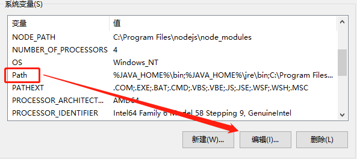

vscode中配置git
===

**vscode 报错 未找到Git。请安装Git,或在"git.path" 设置中配置**

## 第一步安装git
git安装方法自行解决，提供git下载连接！

git官方下载地址 https://git-scm.com/download

## 第二步配置vscode中的git

 在vscode中打开用户设置：文件>首选项>设置，在设置页面按下图进行修改用户配置。
  .jpg)
 修改内容为：

```
 {
    "files.autoSave": "off",
    "git.path":"D:/Program Files/Git/bin/git.exe" /*此路径为自己电脑git的安装路径*/
}
```

*不要使用 windows 的路径风格，例如  C:\\mysoft\\Git\\Git\\bin\\git.exe。*

*要使用   linux style  例如  C:/mysoft/Git/Git/bin/git.exe*。

##### 如果在vscode中无法运行，但是在文件中的git bush中没有问题，则需要配置ssh添加到系统变量的PATH路径中 

#### 配置系统环境变量
windows10下：
此电脑>高级系统设置>环境变量>系统变量>


找到git安装路径，复制路径到变量值中。

**注意路径与路径之间有分号** 

.jpg)

